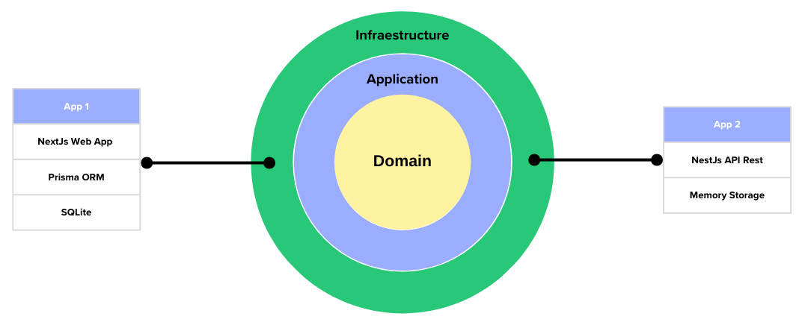

### Hexagonal Architecture using node, NextJs, NestJs

The application and domain logic is extracted in the `my-trello-core` project, and the `nestjs-my-trello` and `nextjs-my-trello` apps use that business logic by installing the `my-trello-core` project as an `npm package`.